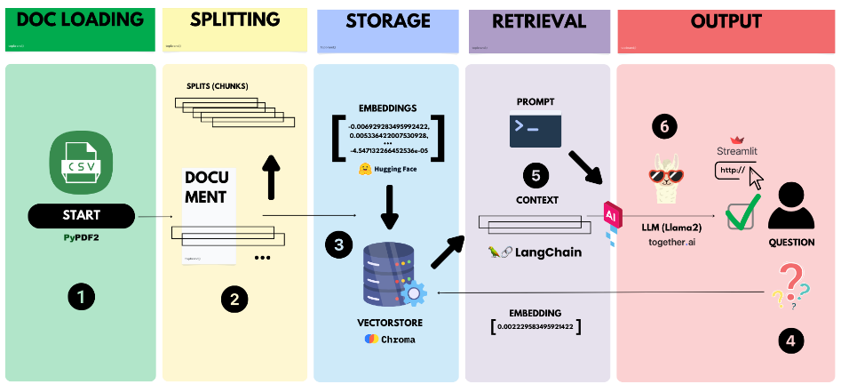

# UPC Datathon 2023
## Fashion Compatibility Challenge 

This repository contains our project Elena, a personal shopper assistant for Mango clothing brand.
The data preprocessing and exploratory data analysis is contained in 2 files, Data_Exploration_MANGO_R.zip and data_preprocessing_and_eda.py. The bot assistant corresponds to the Elena.py file. The frontend is included in the index.html file, it simulates the Mango website where the assistant bot is integrated with Streamlit (https://elena-mango.streamlit.app/).

